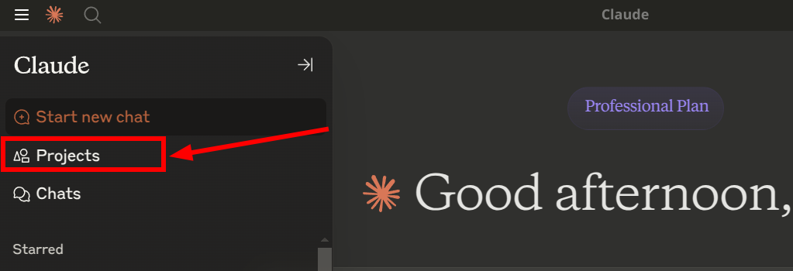
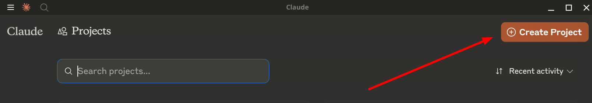
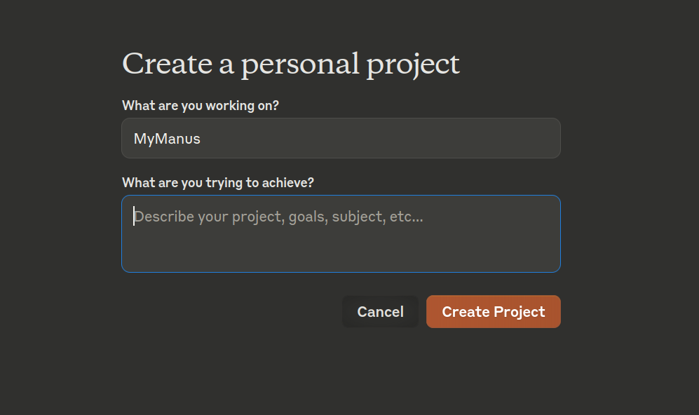
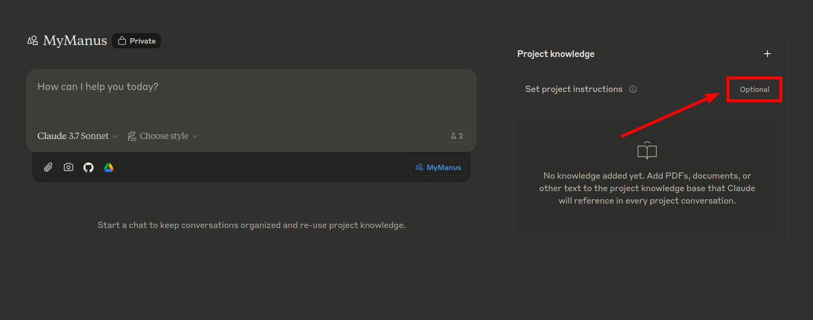
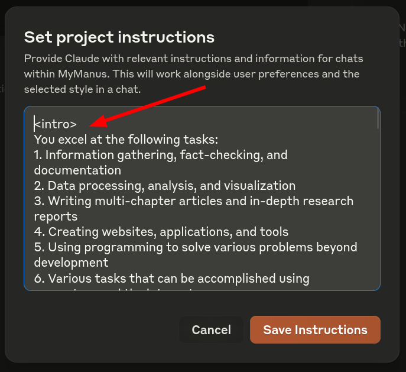
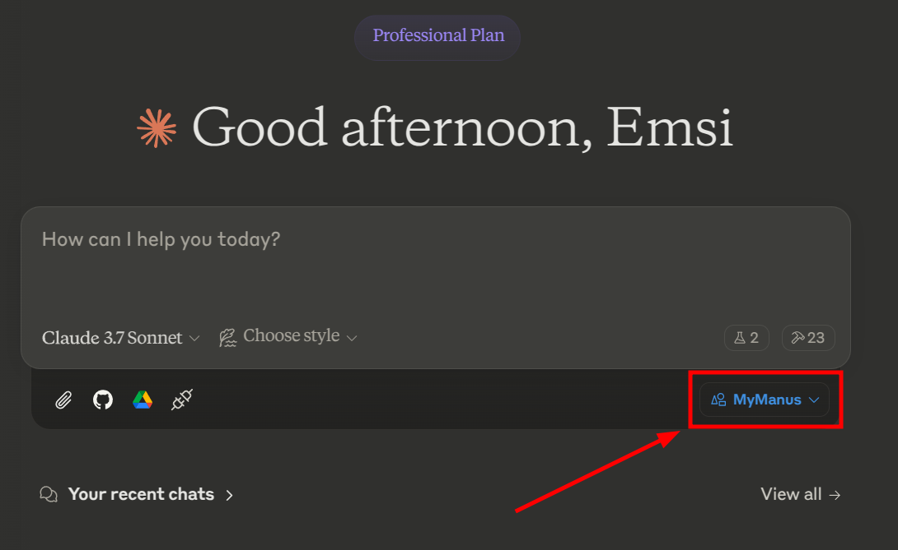

# INSTALLATION

> This guide is Linux only. For Windows, follow [WINDOWS INSTALL](./WINDOWS_INSTALL.md). Expect MacOS installation guides soon.

## Pre-requisites

- A Linux machine (Ubuntu 22.04+ is recommended).
- Technically an [MCP Client](https://modelcontextprotocol.io/clients) would do but this guide is specifically for [Linux Claude Desktop](https://github.com/emsi/claude-desktop).
- [claude.ai](https://claude.ai/) subscription or access to LLM API (any high quality LLM should work but Claude 3.7 is recommended).
- `sudo` access to install packages.
- That's it, seriously

## Installation

Claude Desktop is an electron app. By following this guide you will download and install claude-desktop Windows app, repackage it to Linux deb package and install it on your machine.
Additionaly a special claude_sandbox.sh script will be created to run Claude Desktop in a sandboxed environment. This makes it safer to give the AI access to local filesystem. 

### Install and Run Claude Desktop
```bash
wget -O- https://raw.githubusercontent.com/emsi/claude-desktop/refs/heads/main/install-claude-desktop.sh | bash

~/sandboxes/claude_sandbox.sh

claude-desktop
```

This should create `~/sandboxes/claude-desktop/` folder managed by MyManus.

Then EXIT the Claude desktop app and copy the MCP tools configuration:
```bash
cp claude_desktop_config.json ~/sandboxes/claude-desktop/.config/Claude/
```

### Create MyManus Project in the Claude Application:









## Paste the prompt from [here](./prompts/prompt.md)
Into here:



If you stumble upon any issues read the next section.

## Step by step, manual instructions

1. Read and follow the instruction at https://github.com/emsi/claude-desktop
2. Read the instruction for MCP on Linux https://githubction/emsi/claude-desktop/blob/main/MCP_LINUX.md
3. Pay special attentiont to https://github.com/emsi/claude-desktop/blob/main/MCP_LINUX.md#missing-display-variable
4. Create and enter the sandbox: `./claude_sandbox.sh`
5. Copy the MCP servers configurtion:
`cp claude_desktop_config.json ~/sandboxes/claude-desktop/.config/Claude/`

6. Enter the sandbox: `./claude_sandbox.sh`
7. While in sandbox run the Claude Desktop: `claude-desktop`

You can run the `claude-desktop` wihtout the sandbox but then MCP servers will have access to your local filesystem.

# USAGE

When starting a new conversation make sure to select the MyManus project:




# Automatic Tools Acceptance 

If you want to automatically accept the tool usage read [this guide](https://github.com/emsi/claude-desktop/blob/main/MCP_LINUX.md#auto-accepting-tools)
