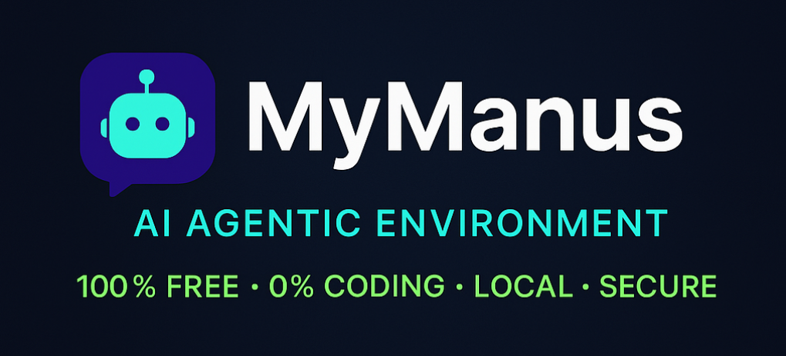

  

 
MyManus is the 100% free, 0% coding, **local**, **secure** agentic environment akin to [Manus AI](https://manus.im/) built entirely around Model Context Protocol [MCP](https://modelcontextprotocol.io/introduction) implementation.

MyManus uses sandboxing to secure your system and allow AI agent to use a browser, create files, run commands, and more.

My Manus securely runs the browser on a local machine rather than on some flimsy cloud server, which makes it fast, free, and reliable.

Thanks to its magic [prompt](./prompts/prompt.md), MyManus plans, reasons, executes, evaluates, and deals with all the issues on its own. 

RESEARCH, CODING, DATA ANALYSIS, PRODUCTIVITY, LIFE, you name it. Depending on the set of tools, it can be used for any task you can imagine.

All that you need is [Claude Desktop](https://github.com/emsi/claude-desktop) app (or any other [MCP Client](https://modelcontextprotocol.io/clients)) and a bunch of existing [MCP servers](https://modelcontextprotocol.io/examples) to set up your ultimate agentic environment, allowing the AI agent to do all the tasks you can imagine. No need to write a single line of code. No need to purchase additional software (apart from an existing [claude.ai](https://claude.ai/) subscription or LLM API).

---

# Installation Options

## For Claude Code (Recommended)

MyManus is now available as a plugin for [Claude Code](https://claude.com/claude-code), Anthropic's official CLI!

**[→ Claude Code Installation Guide](./INSTALL_CLAUDECODE.md)**

## For Claude Desktop

To install MyManus for Claude Desktop app:

**[→ Installation Guide (Linux/macOS)](./INSTALL.md)**
**[→ Windows Installation Guide](./WINDOWS_INSTALL.md)**

---

# [USAGE](./USAGE.md)
To use MyManus, follow the [usage guide](./USAGE.md).

# [EXAMPLES](./EXAMPLES.md)

To see MyManus in action, check out the [examples](./EXAMPLES.md).