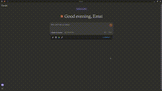

USAGE
=====

When starting a new conversation make sure to select the MyManus project:

If you want to automatically accept the tool usage read [this guide](https://github.com/emsi/claude-desktop/blob/main/MCP_LINUX.md#auto-accepting-tools)