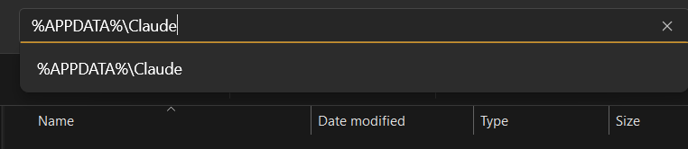

# WINDOWS INSTALLATION

## Pre-requisites

- A modern Windows machine capable of running [Windows Subsystem for Linux (WSL2)](https://learn.microsoft.com/en-us/windows/wsl/install).
- Claude Desktop app installed on Windows.

# WSL2 Installation

Please follow the official guide to install WSL2 on your Windows machine: https://learn.microsoft.com/en-us/windows/wsl/install<br/>

**TL;DR: `wsl --install` then restart your machine.**

## Install Ubuntu 22.04 From MS Store

Go to MS Store and install the latest version of Ubuntu 22.04 LTS.


## Installation

**Before installation make sure that you have run and closed the Claude Desktop app at least once.**

### Install and Run Claude Sandbox
Open your Ubuntu 22.04 LTS from Start Menu and run the following commands:

```bash
wget -O- https://raw.githubusercontent.com/emsi/claude-desktop/refs/heads/main/install-claude-desktop.sh | bash

~/sandboxes/claude_sandbox.sh
```

Copy the `windows_claude_desktop_config.json` from this repo to `%APPDATA%\Claude\` folder **AND RENAME IT TO `claude_desktop_config.json`**.




### Create MyManus Project in the Claude Application:


## Paste the prompt from [here](./prompts/prompt.md)
Into here:


If you stumble upon any issues read the next section.

# USAGE

When starting a new conversation make sure to select the MyManus project:


# Automatic Tools Acceptance

If you want to automatically accept the tool usage read [this guide](https://github.com/emsi/claude-desktop/blob/main/MCP_LINUX.md#auto-accepting-tools)
